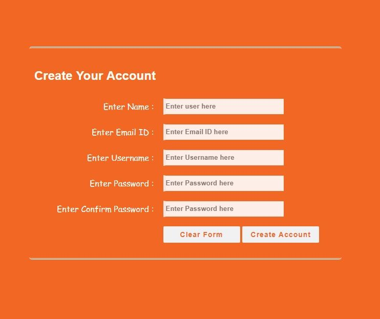

# THE FRONT-END | HTML & CSS BASICS

## Assigment Git Workflow

 - Step one: Fork The repo 
 - Step two: Clone The repo
 - Step three: Start Coding
 - Step four: git add / git commit / git push
 - step five: Create a pull request to your branch

! IMPORTANT: You will need to create a Pull Request merging back into your own repository's main branch and NOT the main repository (SocialHackersAcademy).

#### INSTRUCTIONS

Here are your assignments for this lesson:

**1)** c with just the basic building blocks (doctype, head, body, etc.) 
In the page content explain each element's functionality and role, e.g. DOCTYPE is the document declaration, an instruction to the browser to parse this document as an HTML document, etc.
Use the following HTML elements to create a page with links to various subjects related to the topic.:
  - a, img, p, h1, h2, h3.

**2)** Create a table that contains information about the the `world's biggest polluters`. You should get the information from [this site](https://gulfnews.com/photos/news/who-are-the-worlds-biggest-polluters-1.1572250802844?slide=1).
  - The table must include information about each `country`, the `metric tons per year` that it produces and a reference to the [source](http://www.globalcarbonatlas.org/en/CO2-emissions).

**3)** Create a registration form according to this [screenshot](./ASSETS/exercise-html-form-creation.jpg).

**4)** Create a search engine form that sends the request to bing.
  - The search URL you'll use is the following: [https://www.bing.com/search?q=ferrari](https://www.bing.com/search?q=ferrari)
  - The action URL must be modified accordingly along with the input elements and their respective `name` attributes.

At this stage, you should only consider HTML and **not add any styling yet**.

**5)** Create a copy of the previous HTML pages you've created and style them using CSS:
  - You must include the following in your web pages:
    - inline styles
    - internal style tags `style`
    - external styles, `link`
    - use of classes
    - use of multiple classes per element
    - use of IDs
    - use of `text-align` CSS rule
    - use of `color` and `background-color` CSS rules
    - use of `font-family` and `font-size` CSS rules
    - use of `border` CSS rule
    - Apply colors for both the text content and the background color of the elements. You can choose from the list of available color names found [here](https://developer.mozilla.org/en-US/docs/Web/CSS/color_value#Color_keywords)
    - You are free to use any other CSS rule you like!
    - Be creative!

#### Submission

Don't forget to instructor as a Collaborator to the GitHub repository.

---

_Photo by Miguel Á. Padriñán from Pexels_
